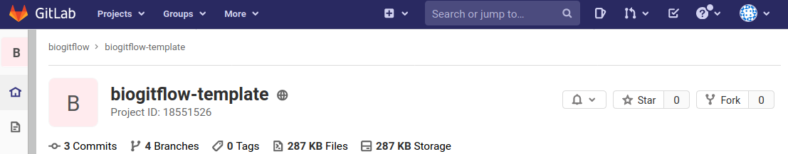

..   This file is part of biogitflow
   
     Copyright Institut Curie 2020-2021
     
     This file is part of the biogitflow documentation.
     
     You can use, modify and/ or redistribute the software under the terms of license (see the LICENSE file for more details).
     
     The software is distributed in the hope that it will be useful, but "AS IS" WITHOUT ANY WARRANTY OF ANY KIND. Users are therefore encouraged to test the software's suitability as regards their requirements in conditions enabling the security of their systems and/or data. 
     
     The fact that you are presently reading this means that you have had knowledge of the license and that you accept its terms.

.. include:: substitutions.rst

.. _exercises-page:

*********
Exercises
*********

We provide here a set of exercises for anyone willing to practice the procedures. Log-in on  `GitLab.com <https://gitlab.com/users/sign_in>`_ (if you do not have an account yet, just register), and go to the |biogitflowtemplate|_. Fork the project into your personal `GitLab.com <https://gitlab.com/users/sign_in>`_ account with the dedicated button:

Assuming that your log-in on `GitLab.com <https://gitlab.com/users/sign_in>`_ is `mypseudo`, clone your personal repository on your computer as follows:

.. code-block:: bash

  git clone https://gitlab.com/mypseudo/biogitflow-template.git
  cd biogitflow-template

If needed, add new members to your repository if your want to test the procedure with other persons in your team.

The exercices are split in two sections:

* the :ref:`exercices-soft` section is dedicated to the persons with the (D+UD) :ref:`devel-workflow-overview-roles`
* the :ref:`exercices-deploy` is dedicated to the persons with the (M+UVP) :ref:`devel-workflow-overview-roles`

.. _exercices-soft:

Software development
====================

Ex1: |step1| with the nominal procedure
---------------------------------------

In this exercise, the person has the (D+UD) :ref:`devel-workflow-overview-roles`. The person must perform the actions is allowed to from the :ref:`nominal-page` detailed in the :ref:`nominal-technical`.

* The developer implements a new feature by creating a 'Hello World' script (in any preferred language)

* The developer sends the script to remote repository

* The developer deploys the new code in the **dev** environment to test it

Ex2: |step3| with development of correction with the nominal procedure
----------------------------------------------------------------------

In this exercise, the person has the (D+UD) :ref:`devel-workflow-overview-roles`. The person must perform the actions is allowed to from the :ref:`nominal-page` detailed in the :ref:`nominal-technical`.

Let's assume that the (M+UVP) user has deployed the code in the **valid** environment but there is a bug during the :ref:`step3-nominal-testvalid` step:

* The developer (D+UD) must correct the bug on the code he developed

* The developer (D+UD) must test and validate the correction

* The developer submits the correction to the (M+UVP) user

Then the user (M+UVP) must deploy the corrected code in the **valid** and **prod** environments (according to the :ref:`step3-nominal-deployvalid` and :ref:`step4-nominal-deployprod`).

Ex3: |step1| and |step2| with the hotfix procedure
--------------------------------------------------

In this exercise, the person has the (D+UD) :ref:`devel-workflow-overview-roles`. The person must perform the actions is allowed to from the :ref:`hotfix-page` detailed in the :ref:`hotfix-technical`.

Let's assume that a bug occurred in the pipeline that is deployed in the **prod** environment.

* The developer (D+UD) must correct the code

* The developer (D+UD) must test and validate the correction

* The developer submits the correction to the (M+UVP) user

Then the user (M+UVP) must deploy the corrected code in the **valid** and **prod** environments (according to the :ref:`step3-hotfix-deployvalid` and :ref:`step4-hotfix-deployprod`).

.. _exercices-deploy:

Deployment in the valid and prod environments
=============================================

Ex1: |step2| and |step3| with the nominal procedure
---------------------------------------------------

In this exercise, the person has the (M+UVP) :ref:`devel-workflow-overview-roles`. The person must perform the actions form the :ref:`nominal-page` detailed in the :ref:`nominal-technical`. The person must:

* update the CHANGELOG file

* bring the code from the devel branch to the release branch

* deploy the code in the **valid** environment

* perform the validation of the code

Ex2: |step3| with developement of correction with the nominal procedure
-----------------------------------------------------------------------

In this exercise, the person has the (M+UVP) :ref:`devel-workflow-overview-roles`. The person must perform the actions form the :ref:`nominal-page` detailed in the :ref:`nominal-technical`.

Let's assume that the (M+UVP) user has deployed the code in the **valid** environment but there is a bug during the :ref:`step3-nominal-testvalid`. The developer (D+UD) implemented and submit the correction to the (M+UVP) user who has to:

* take care of the Merge Request created by the developer (D+UD)

* follow the remaining actions in the :ref:`step3-nominal-technical`

Ex3: |step4| with the nominal procedure
---------------------------------------

In this exercise, the person has the (M+UVP) :ref:`devel-workflow-overview-roles`. The person must perform the actions form the :ref:`nominal-page` detailed in the :ref:`nominal-technical`. The user has to:

* deploy the code in the **prod** environment

* perform the required validation

* bring the code from the release branch to the main, hotfix and devel branches

Ex4: |step3| and |step4| with the hotfix procedure
--------------------------------------------------

In this exercise, the person has the (M+UVP) :ref:`devel-workflow-overview-roles`. The person must perform the actions form the :ref:`hotfix-page` detailed in the :ref:`hotfix-technical`. 

Let's assume that a bug occurred in the pipeline that is deployed in the **prod** environment. The developer (D+UD) implemented and submitted the correction to the (M+UVP) user who has to:

* take care of the Merge Request created by the developer (D+UD)

* follow the remaining actions in the :ref:`step3-hotfix-technical` and :ref:`step4-hotfix-technical`

