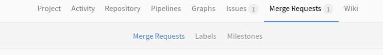
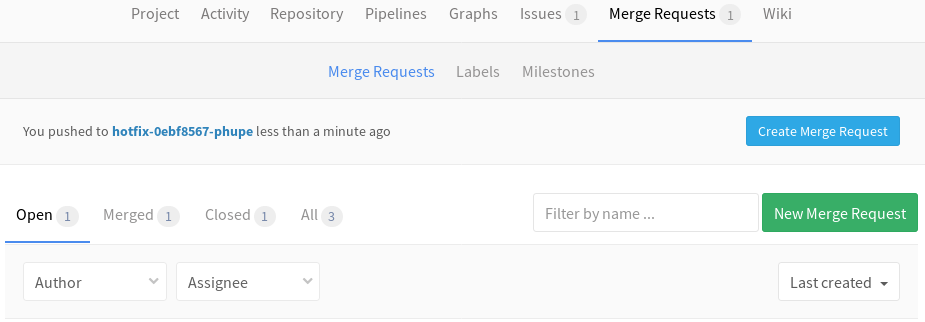
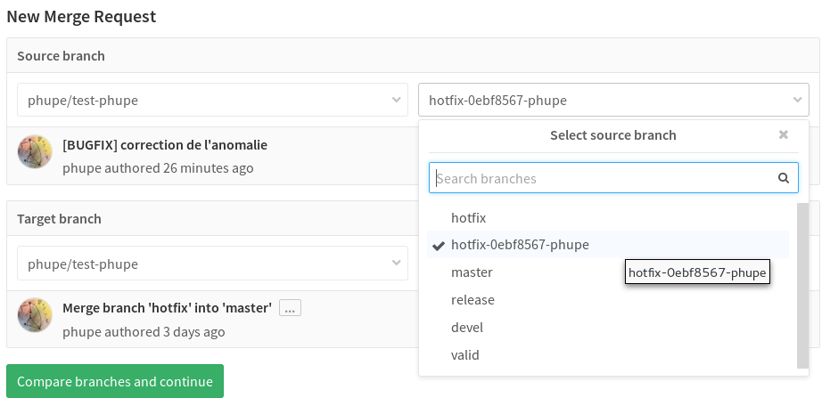
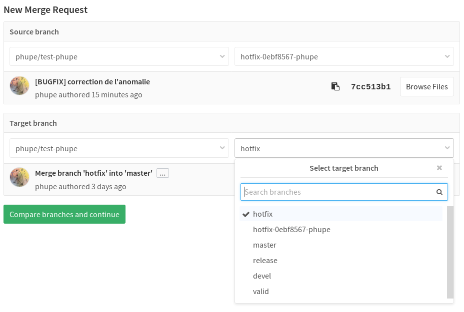
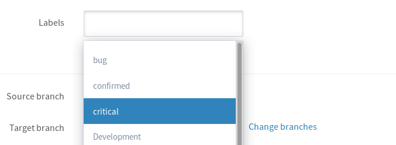
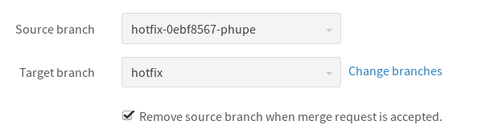
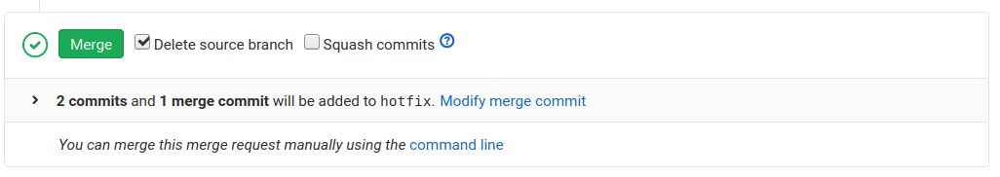
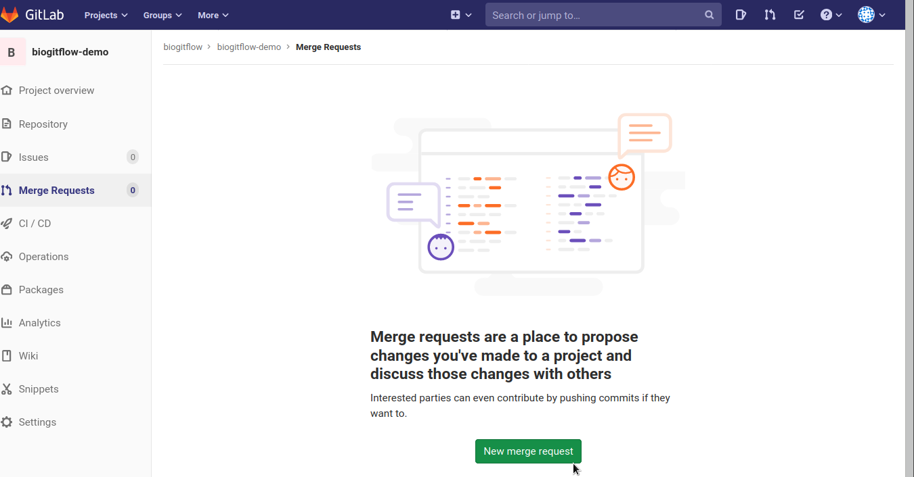
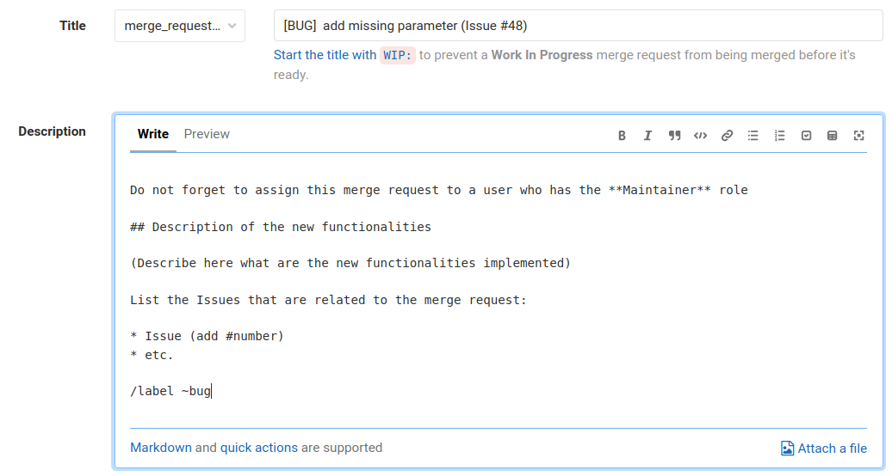

..   This file is part of biogitflow
   
     Copyright Institut Curie 2020-2024
     
     This file is part of the biogitflow documentation.
     
     You can use, modify and/ or redistribute the software under the terms of license (see the LICENSE file for more details).
     
     The software is distributed in the hope that it will be useful, but "AS IS" WITHOUT ANY WARRANTY OF ANY KIND. Users are therefore encouraged to test the software's suitability as regards their requirements in conditions enabling the security of their systems and/or data. 
     
     The fact that you are presently reading this means that you have had knowledge of the license and that you accept its terms.

.. _gitlab-merge-request:

Create a Merge Request in Gitlab
================================

Add a new Merge Request
-----------------------

- Click in the **Merge Requests** menu in the left panel:

Set the source branch
---------------------

|MR-sourcebranch|

Set the target branch
---------------------

|MR-targetbranch|

Add a description using the Merge Request template
--------------------------------------------------

Assign the Merge Request to a user with the Maintainer role
-----------------------------------------------------------

|MR-assign|

Add a label
-----------

The default label in the Merge Request template is |label_bug|. Change it if needed:

|MR-label|

Set the option to delete the branch after the merge
---------------------------------------------------

|MR-removebranch|

Submit the Merge Request
------------------------

Click on **Submit merge request**.

Review and merge of the Merge Request by the Maintainer
-------------------------------------------------------

The **Maintainer**  reviews the Merge Request and click on **Merge**:

|MR-accept|

