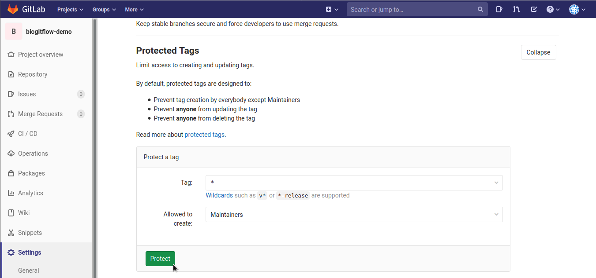
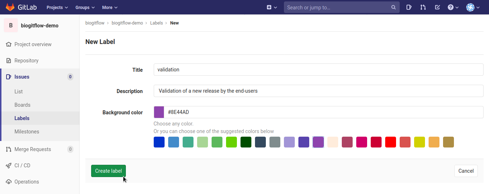

..   This file is part of biogitflow
   
     Copyright Institut Curie 2020-2021
     
     This file is part of the biogitflow documentation.
     
     You can use, modify and/ or redistribute the software under the terms of license (see the LICENSE file for more details).
     
     The software is distributed in the hope that it will be useful, but "AS IS" WITHOUT ANY WARRANTY OF ANY KIND. Users are therefore encouraged to test the software's suitability as regards their requirements in conditions enabling the security of their systems and/or data. 
     
     The fact that you are presently reading this means that you have had knowledge of the license and that you accept its terms.

.. _gitlab-new-project:

Create a new project in Gitlab
==============================

We recommend that the project is created from the |biogitflowtemplate|_ or you can follow the procedure below.

Add the new projet
------------------

- Select **Projects** in the upper left menu

- Click on |gitlab_new-project-button|

- Link your project to a group (if needed)

- Give a name and a description to your new project

- Check that the **Visibility Level** is set to **Private**

- Select the option **Initialize repository with a README**

Add the templates for the issues and merge requests
------------------------------------------------------

- Clone the new project:

::

   git clone git@gitlab.com:biogitflow/biogitflow-demo.git
   cd biogitflow-demo

- Create the hidden folder ``.gitlab``:

::

   mkdir .gitlab

- Copy the content of the directory |biogitflowtemplatedir|_  such that the ``.gitlab`` folder contains the following folders:

::

    issue_templates
    merge_request_templates

- Push the templates on the **main** branch on the |repo|:

::

    git add .gitlab
    git commit -m "[ADD] templates for issues and merge requests"
    git push origin main

Create the branches
-------------------

- Click in the **Repository** menu in the left panel, in order to create the **release**, **hotfix** and **devel** branches from the **main** branch

   - Click on the **New branch** button:

   |gitlab-newbranch|

   - in the form, fill **Branch name = devel** and **Create from = main**
    
   |gitlab-newproject-branch-devel|

   - Iterate the same procedure twice to create:

    - the **release** branch

    - the **hotfix** branch

Set the default branch
----------------------

- Click in the **Settings** menu in the left panel, select the **Repository** sub-menu, then click on the **Default Branch** button to expand the section:

- Select **Default branch = devel** in the scrolling menu and click on the **Save changes** button:

Set the protected branches
--------------------------

- Click in the **Settings** menu in the left panel, select the **Repository** sub-menu, then click on the **Protected Branches** button to expand the section:

- Protect the **release** branch such that only the users with the **Maintainers** role can **push** and **merge**:

  - In the form select **Branch = release**, **Allowed to merge = Maintainers** and **Allowed to push = Maintainers**, then click on the **Protect** button:

.. figure:: images/gitlab_protect_branch_release.png

- Check that **main**, **hotfix** and **release** branches are protected

Set the protected tags
----------------------

The use of the tags is reserved to the user with the **Maintainer** role.

- Click in the **Settings** menu in the left panel, select the **Repository** sub-menu, then click on the **Protected Tags** button to expand the section:

- In the fields **Tag**, add **\*** and then click on **Create wildcard \***
 

- Check that the field **Allowed to create** is set to **Maintainers** and then click on the **Protect** button:

Add a set of labels for the issues
----------------------------------

- Click in the **Issues** menu in the left panel, select the **Labels** sub-menu
  
- It is possible that some labels already exist if the project has been created inside a group for which some labels have been already set (using the **Promote to Group Label** functionality for example)

- If there is no label, then click  on **Generate a default set of labels**:

- Create the labels need by |biogitflowdoc| that are not in the default set:

- Create the new labels |label_validation| for the **Validation of a new release by the end-users**:

- Create the new label |label_mep| for the **Deployment in the production environment**:

  .. figure:: images/gitlab_add_label_production.png

- Check that all the labels required by |biogitflowdoc| are available:

  - |label_enhancement|
  - |label_bug|
  - |label_validation|
  - |label_mep|

Add members to the project
--------------------------

- Click in the **Settings** menu in the left panel, select the **Members** sub-menu

   - by default, all the members of the group have access to the new project

   - if needed, add additional members with their specific role

  .. figure:: images/gitlab_add_members.png
