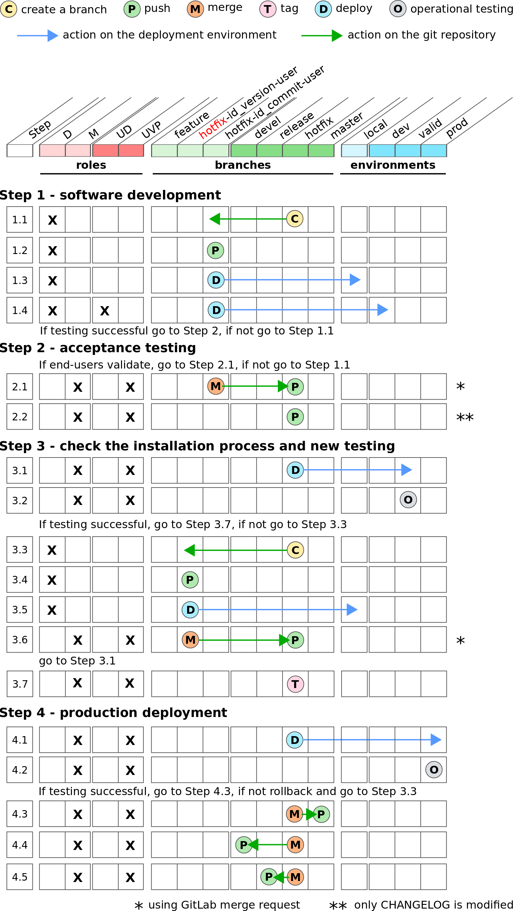

..   This file is part of biogitflow
   
     Copyright Institut Curie 2020
     
     This file is part of the biogitflow documentation.
     
     You can use, modify and/ or redistribute the software under the terms of license (see the LICENSE file for more details).
     
     The software is distributed in the hope that it will be useful, but "AS IS" WITHOUT ANY WARRANTY OF ANY KIND. Users are therefore encouraged to test the software's suitability as regards their requirements in conditions enabling the security of their systems and/or data. 
     
     The fact that you are presently reading this means that you have had knowledge of the license and that you accept its terms.

.. include:: substitutions.rst

.. _hotfix-page:

****************
Hotfix procedure
****************

This section describes the second use case to correct a critical bug that has occurred in the production environment.

.. include:: hotfix-mode-overview.inc.rst
.. include:: hotfix-mode-technical.inc.rst

.. _hotfix-synopsis:

Graphical synopsis of the procedure
===================================

