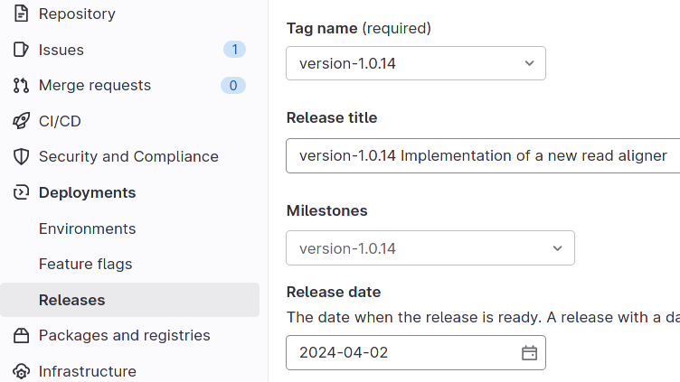

..   This file is part of biogitflow
   
     Copyright Institut Curie 2020-2024
     
     This file is part of the biogitflow documentation.
     
     You can use, modify and/ or redistribute the software under the terms of license (see the LICENSE file for more details).
     
     The software is distributed in the hope that it will be useful, but "AS IS" WITHOUT ANY WARRANTY OF ANY KIND. Users are therefore encouraged to test the software's suitability as regards their requirements in conditions enabling the security of their systems and/or data. 
     
     The fact that you are presently reading this means that you have had knowledge of the license and that you accept its terms.

.. _nominal-technical:

Technical procedure
===================

.. _step1-nominal-technical:

|step1|
-------

.. _step1-nominal-technical-issue:

|step1-issue|
~~~~~~~~~~~~~

- The |userd| reads the specifications of the new feature to be implemented in the |gitlabissue| or writes them in a new |gitlabissue| using the template :download:`new_feature <data/templates/issue_templates/new_feature.md>`.

.. _step1-nominal-technical-cw:

|step1-cw|
~~~~~~~~~~

- The |userd| clones the |repo|:

.. code-block:: bash

   git clone git@gitlab.com:biogitflow/biogitflow-demo.git 

- The |userd| enters the folder in the |wks|:

.. code-block:: bash

   cd my_project

- The |userd| switches to the **devel** branch in the |wks|, gets the last modifications from the |repo| and checks that the right branch is used:

.. code-block:: bash

   git checkout devel
   git pull
   git submodule update --init --recursive # if your git repo has submodules
   git branch -vv

- The |userd| creates a local branch named **feature** (it is recommended to give a meaningful name such as **feature_star_mapper**)  and uses it to implement the new expected feature:

.. code-block:: bash

   git checkout -b feature
   git branch -vv

- The |userd| implements the new feature.

- The |userd| tests the code (unit testing).

- The |userd| checks which files have been modified:

.. code-block:: bash

   git status

- The |userd| specifies which files to be added in the staging area:

.. code-block:: bash

   git add myScript.sh

- The |userd| commits the modifications with an explicit message using the :ref:`git-commit-convention`. The |gitlabissue| number is also reported in the commit message:

.. code-block:: bash

   git commit -m "[MODIF] Sorting algorithm optimisation (Issue #11)"

.. note.. code-block:: bash

   Files can be added and committed in several times such that the commit messages can be different and specific to the modifications that have been implemented, for example:

    - "[MODIF] Optimisation of the alignement (Issue #10)"
    - "[DOC] details of the function foo added (Issue #12)"

- Once the developments have been completed and committed on the local **feature** branch, the |userd| switches to the **devel** branch:

.. code-block:: bash

   git checkout devel

-  The |userd| updates the |wks| with the |repo|:

.. code-block:: bash

  git pull
  git branch -vv

- The |userd| brings the content of the **feature** branch into the **devel** branch:

.. code-block:: bash

  git merge feature

- If needed, the |userd| resolves the conflicts and checks that the code is still functional after the merge.

- The |userd| pushes the new version from the **devel** branch on the |repo|:

.. code-block:: bash

   git push origin devel

- The |userd| deploys the code from the **devel** branch either in a personal environment for testing or in the **dev** environment to perform unit, integration, system and regression testing.

- The |userd| checks that the expected functionalities have been correctly implemented.

- The |userd| checks that all the modified files have been committed and pushed on the |repo|:

.. code-block:: bash

   git status

- The |userd| deletes the local branch:

.. code-block:: bash

   git branch -d feature

.. _step1-nominal-deploydev:

|step1-ud|
~~~~~~~~~~

The |userd-ud| deploys the |soft| in the **dev** environment from the **devel** branch using the ad-hoc deployment scripts. **The deployement is only based on a commit ID**.

.. danger::

   |dangertag|

At this stage, the current version under development, is deployed in ``/bioinfo/pipelines/foobar/dev`` and the file ``/bioinfo/pipelines/foobar/dev/version`` contains the commit ID that has been deployed.

|step1-testing|
~~~~~~~~~~~~~~~

- The |userd-ud| performs unit, integration, system and regression testing. Other developers who implemented the new feature can contribute to validate all or part of the testing. If the testing is successful, we move to the :ref:`step2-nominal-technical`, if not, we go back to the :ref:`step1-nominal-technical`.

.. _step2-nominal-technical:

|step2|
-------

|step2-acceptance|
~~~~~~~~~~~~~~~~~~

- The |userd-ud| creates a |gitlabissue| using the template :download:`validation <data/templates/issue_templates/validation.md>`.

- The title of the |gitlabissue| must indicate the characteristics of the version to be validated.

- The description in the |gitlabissue| lists the new features/modifications that have to be communicated to the end-users.

- At the end of the description, a line such as **fyi: @user1, @user2, @user3** is added such that all the persons involved in the validation process receive a notification.

- The |gitlabissue| is labeled with |label_validation|.

- The |gitlabissue| is assigned to a |userm-uvp|.

- The |userd-ud| or the |userm-uvp| sends an email to all the persons who are involved in the validation process.

- The end-users can start the acceptance testing process:

  - either the end-users validate the new release,

  - or the end-users do not validate the new release. Then, the reason are tracked in the |gitlabissue| |label_validation| that has been created. We go back to :ref:`step1-nominal-technical`. The |userd| develops the modifications requested by the end-users on a local **feature** branch derived from the **devel** branch. The process is iterated until the validation by the end-users. The same |gitlabissue| is used to track all the information during the validation process until the final validation.

|step2-optesting|
~~~~~~~~~~~~~~~~~

- The |userm-ud| checks that the deployment with |gitlabci| is available for the |gitlab| repository. It requires the file ``.gitlab-ci.yml`` as defined in the template pipeline.

- In the ``.gitlab-ci.yml`` file, the operational testing is implemented through different jobs which launch the pipeline twice during the :ref:`step1-nominal-deploydev` and compare the results to ensure they are identical.

- The |userm-ud| modifies (if needed) the script to compare the results (e.g. ``optest/optest.sh``).

- The |userm-ud| modifies (if needed) the test dataset used to launch the pipeline

- If the operational testing fails (the |soft| does not work or is not reproducible), go back to the :ref:`step1-nominal-technical`.

|step2-changelog|
~~~~~~~~~~~~~~~~~

.. note::

   The CHANGELOG file provides a simple history of the different versions of the |soft|. The version numbers are listed by decreasing order.
   
   - A version number is added in the CHANGELOG using the following naming convention: **version-x.y.z**:

     - The **z** number is incremented for BUG FIXES of modifications which are not visible by the end-user

     - The **x.y** numbers are incremented for major modifications considered as SIGNIFICANT USER-VISIBLE CHANGES
   
   - Comments are added in the CHANGELOG to describe the most relevant functionalities added to the new release.

   The CHANGELOG is divided into 3 sections:
   
   -  ``NEW FEATURES``
   -  ``SIGNIFICANT USER-VISIBLE CHANGES``
   -  ``BUG FIXES``

   Example of CHANGELOG file:
   
   .. literalinclude:: data/CHANGELOG

- The |userm-ud| updates the **devel** branch to get the last modifications from the |repo| and checks that the right branch is used:

.. code-block:: bash

   git checkout devel
   git pull
   git branch -vv

- If needed, the |userm-ud|  asks the other developers to define what comments should be added in the CHANGELOG and pushes the modifications on the |repo|:

.. code-block:: bash

   git add CHANGELOG
   git commit -m "[DOC] information about the version-1.2.3 added in the CHANGELOG"
   git push origin devel

.. _step2-milestone:

|step2-milestone|
~~~~~~~~~~~~~~~~~

As mentioned, a :ref:`step1-nominal-technical-issue` is created whenever a new development is started. As new version encompasses several issues, it is important to track all the issues which have been considered in the new version. Therefore, the |userm-ud|:

- creates a new |gitlabmilestone| with the same name as the new version number (e.g. **version-x.y.z**),

- describes what is the purpose of the new |gitlabmilestone|,

- adds the relevant issues in the |gitlabmilestone|.

.. note::

   As your developments may depend on other |gitlab| repositories you maintain, you can also create another |gitlabmilestone| in each of them and cross-referenced the milestones in the different repositories. To do so, you can just add in the field **Description** of the **Milestone** the URL of the other **Milestones**.

.. _step3-nominal-technical:

|step3|
-------

Bring the content of the devel branch into the release branch
~~~~~~~~~~~~~~~~~~~~~~~~~~~~~~~~~~~~~~~~~~~~~~~~~~~~~~~~~~~~~

- The |userm-uvp| switches to **release** branch from the |wks| and updates it:

.. code-block:: bash

   git checkout release
   git status
   git pull
   git branch -vv

- The |userm-uvp|  brings the content of the **devel** branch into the **release** branch using the option ``--no-ff`` to avoid the fast-forward mode. This option will produce a new commit ID with a specific message to describe and track the merge:

.. code-block:: bash

   git merge --no-ff devel

- The |userm-uvp| pushes the modifications from the **release** branch on the |repo|:

.. code-block:: bash

   git push origin release

- The |userm-uvp| creates a |gitlabissue| using the template :download:`deploy_in_prod <data/templates/issue_templates/deploy_in_prod.md>`:

  - The |gitlabissue| is labeled with |label_mep|.

  - The number of the |gitlabissue| opened with the label |label_validation| along with the numbers of the other Issues that describe the new features of the new release are added for tracking in this new |gitlabissue|.

  - The different steps of the deployment in production are recorded to track all the information about the installation along with the information about the data that have been used.

  - Every time a new step is performed for the installation, the new information are appended in the |gitlabissue|.

.. _step3-nominal-deployvalid:

|step3-deployvalid|
~~~~~~~~~~~~~~~~~~~

The |userm-uvp| deploys the pipeline in the **valid** environment from the **release** branch using the ad-hoc deployment scripts. **The deployement is only based on a commit ID**.

.. danger::

   |dangertag|

At this stage, the current version under development, is deployed in ``/bioinfo/pipelines/foobar/valid`` and the file ``/bioinfo/pipelines/foobar/valid/version`` contains the commit ID that has been deployed.

.. _step3-nominal-testvalid:

|step3-testvalid|
~~~~~~~~~~~~~~~~~

The |userm-uvp| tests the |soft|.

Implement and launch the operational testing using |gitlabci|
~~~~~~~~~~~~~~~~~~~~~~~~~~~~~~~~~~~~~~~~~~~~~~~~~~~~~~~~~~~~~

- The |userm-ud| checks that the deployment with |gitlabci| is available for the |gitlab| repository. It requires the file ``.gitlab-ci.yml`` as defined in the template pipeline.

- In the ``.gitlab-ci.yml`` file, the operational testing is implemented through different jobs which launch the pipeline twice during the :ref:`step3-nominal-deployvalid` and compare the results to ensure they are identical.

- If the operational testing fails (the |soft| does not work or is not reproducible), go back to the :ref:`step1-nominal-technical`.

.. _step3-nominal-corrections:

Development of corrections if needed
~~~~~~~~~~~~~~~~~~~~~~~~~~~~~~~~~~~~

In most of the cases, the deployment in the **valid** environment is very simple and quick. However, it might be necessary to correct some bugs before the deployment in production. In that case:

- The |userd| checkouts and updates the **release** branch from the |wks|:

.. code-block:: bash

   git checkout release
   git status
   git pull
   git branch -vv

- The |userd| creates a local branch named **release-id_version-user** (e.g. release-version-1.2.3-phupe), the release-version is retrieved from the CHANGELOG file) and uses it for the developments:

.. code-block:: bash

   git checkout -b release-id_version-user # change the id_version and user values

- The |userd| implements the corrections, tests the modifications and commits them (see :ref:`step1-nominal-technical-cw` for the details about the command lines).

- The |userd| temporarily pushes the local branch on the |repo|:

.. code-block:: bash

   git push origin release-id_version-user # change the id_version and user values

- The |userd| deploys the code from the **release-id\_version-user** branch either in a personal environment for testing or in the **dev** environment to perform unit, integration, system and regression testing.

- Once the code validated, the |userd|:

  - creates a :ref:`gitlab-merge-request` from the **release-id\_version-user** branch on the **release** branch using the template :download:`merge_request_template.md <data/templates/merge_request_templates/merge_request_template.md>`,

  - selects the **Milestone** (see :ref:`step2-milestone`),

  - assigns the **Merge request** to a user with the **Maintainer** role.

- The |userm-uvp| reviews and accepts the **Merge Request**.

- The |userm-uvp| updates the **release** branch from the |wks|:

.. code-block:: bash

   git checkout release
   git status
   git pull
   git branch -vv

- The |userm-uvp| go back to :ref:`step3-nominal-deployvalid`.

|step3-tag|
~~~~~~~~~~~

Once the new release has been validated and the installation in the **valid** environment is successful, the |userm-uvp| adds a **tag** (using the same version number that has been written in the CHANGELOG file) on the current HEAD:

.. code-block:: bash

   tag-version4prod.sh -t version-1.2.3
   git push --tags

.. note::

   The script :download:`tag-version4prod.sh <data/tag-version4prod.sh>` checks that the tag name is consitent with what was mentioned in the CHANGELOG and add the tag.

|step4|
-------

|step4-updatelocal|
~~~~~~~~~~~~~~~~~~~

It is likely that the local repository is not up-to-date anymore especially if a **Merge Request** has been submitted on |gitlaburl|_. The |userm-uvp| updates the |wks|:

.. code-block:: bash

   git checkout release
   git status
   git pull
   git branch -vv

.. _step4-nominal-deployprod:

|step4-deployprod|
~~~~~~~~~~~~~~~~~~

The |userm-uvp| deploys the |soft| in the **prod** environment from the **release** branch using the ad-hoc deployment scripts. **The deployment is only based on a commit ID**. The last commit ID from the **release** branch must be deployed.

.. danger::

   |dangertag|

At this stage, the current version under development, is deployed in ``/bioinfo/pipelines/foobar/prod`` and the file ``/bioinfo/pipelines/foobar/prod/version`` contains the commit ID that has been deployed.

|step4-newrelease|
~~~~~~~~~~~~~~~~~~

The |userm-uvp| closes the milestone (see :ref:`step2-milestone`) and issues related to the new version. Then, the |userm-uvp| creates a **New release** in |gitlab|:

- Select the **Tag name** corresponding to the new release

- Fill in the **Release title** with the **version number** followed by free comments

- Select the **Milestone** corresponding to the new release

Schedule an operational testing in |gitlabci|
~~~~~~~~~~~~~~~~~~~~~~~~~~~~~~~~~~~~~~~~~~~~~

- The |userm-ud| checks that the deployment with |gitlabci| is available for the |gitlab| repository. It requires the file ``.gitlab-ci.yml`` as defined in the template pipeline.

- In the ``.gitlab-ci.yml`` file, the operational testing is implemented through different jobs which launch the pipeline twice during the :ref:`step4-nominal-deployprod` and compare the results to ensure they are identical.

- The |userm-ud| connects to |gitlab| to :ref:`gitlab-ci-optest-page` if it is not yet scheduled.

Bring the content of the release branch into the main branch
~~~~~~~~~~~~~~~~~~~~~~~~~~~~~~~~~~~~~~~~~~~~~~~~~~~~~~~~~~~~~~

- At this stage, there is a stable code on the **release** branch that has been tested, validated and successfully installed in the **prod** environment.

- The |userm-uvp| checkouts and updates the **main** branch:

.. code-block:: bash

   git checkout main
   git status # everything must be cleaned
   git pull
   git branch -vv

- The |userm-uvp| brings the content of the **release** branch into the **main** branch using the option  ``--no-ff`` to avoid the fast-forward mode. This option will produce a new commit ID with a specific message to describe and track the merge:

.. code-block:: bash

   git merge --no-ff release # can be a bit verbose
   git status # must be cleaned
   git branch -vv

- The ``git status`` must absolutely says something like this (otherwise, ask for help before moving forward):

::

  # On branch main
  # Your **branch is ahead of 'origin/main' by** 113 commits.
  # (use "git push" to publish your local commits)
  #
  # nothing to commit, working directory clean

- The |userm-uvp| pushes the modifications on the |repo|:

.. code-block:: bash

   git push origin main

Bring the content of the release branch into the hotfix branch
~~~~~~~~~~~~~~~~~~~~~~~~~~~~~~~~~~~~~~~~~~~~~~~~~~~~~~~~~~~~~~

- At this stage, there is a stable code on the **release** branch that has been tested, validated and successfully installed in the **prod** environment and merged with the **main** branch.

- The |userm-uvp| checkouts and updates the **hotfix** branch:

.. code-block:: bash

   git checkout hotfix
   git status # must be cleaned otherwise, commit or stash your modifications
   git pull
   git branch -vv

- The |userm-uvp| brings the content of the **release** branch into the **hotfix** branch using the option ``--ff-only`` to only use the fast-forward mode in order to have the exact same commit ID between the **release** branch and the **hotfix** branch:

.. code-block:: bash

   git merge --ff-only release # always us the options --ff-only
   git status # must be clean
   git branch -vv

- The ``git status`` must absolutely says something like this (otherwise, ask for help before moving forward):

::

  # On branch main
  # Your **branch is ahead of 'origin/main' by** 113 commits.
  # (use "git push" to publish your local commits)
  #
  # nothing to commit, working directory clean

- The |userm-uvp| pushes the merge on the |repo|.

.. code-block:: bash

   git push origin hotfix

Bring the content of the release branch into the devel branch
~~~~~~~~~~~~~~~~~~~~~~~~~~~~~~~~~~~~~~~~~~~~~~~~~~~~~~~~~~~~~

- At this stage, there is a stable code on the **release** branch that has been tested, validated and successfully installed in the **prod** environment and merged with the **main** and the **hotfix** branches.
- This step is necessary if some commits have been done on the **release** branch (this occurs only if there was a :ref:`step3-nominal-corrections`).

- The |userm-uvp| checkouts and updates the **devel** branch:

.. code-block:: bash

   git checkout devel
   git status # must be cleaned otherwise, commit or stash your modifications
   git pull
   git branch -vv

- The |userm-uvp| brings the content of the **release** branch into the **devel** branch:

.. code-block:: bash

   git merge --no-ff release # may be verbose
   git status # may say something
   git branch -vv

- If the **devel** branch has been modified in the meantime, git will try to merge the modifications from the **release** branch.

- If some files cannot be merged automatically, they will appear to have **conflicts** in the output of the ``git status``:

.. code-block:: bash 

  # On branch devel
  # You have unmerged paths.
  # (fix conflicts and run "git commit")...
  # (use "git add ..." to mark resolution)
  # both modified:build.xml

- The conflicts have to be resolved manually. In that case, ask the help from the other developers.

- The files with resolved conflicts must be added to the staging area, committed, and the merge must be sent on the |repo|:

.. code-block:: bash

   git push origin devel

- The |userm-uvp| closes the |gitlabissue| |label_validation| and the |gitlabissue| |label_mep| that have been opened.

Back on the devel branch
~~~~~~~~~~~~~~~~~~~~~~~~

For security reason, the |userm-uvp| switches on the **devel** branch to avoid any risk of code modification on the **main** branch:

.. code-block:: bash

   git checkout devel
   git pull
   git branch -vv

