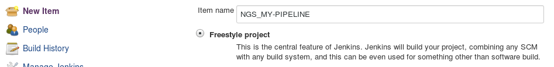
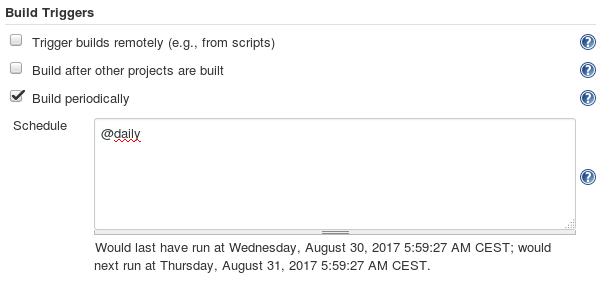
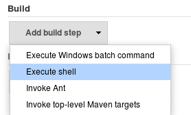
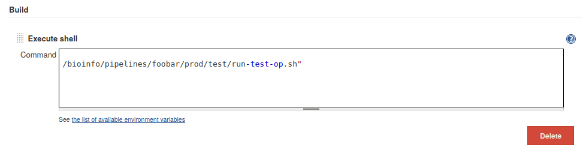
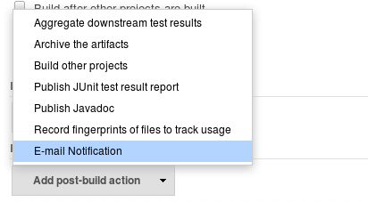
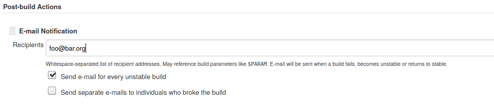

..   This file is part of biogitflow
   
     Copyright Institut Curie 2020
     
     This file is part of the biogitflow documentation.
     
     You can use, modify and/ or redistribute the software under the terms of license (see the LICENSE file for more details).
     
     The software is distributed in the hope that it will be useful, but "AS IS" WITHOUT ANY WARRANTY OF ANY KIND. Users are therefore encouraged to test the software's suitability as regards their requirements in conditions enabling the security of their systems and/or data. 
     
     The fact that you are presently reading this means that you have had knowledge of the license and that you accept its terms.

.. include:: substitutions.rst

.. _jenkins-page:

Configure an operational testing
================================

This section describes how to configure an operational testing with |jenkins|.

.. note::

   Other tools can be used for this purpose such as the he `GitLab CI/CD <https://docs.gitlab.com/ce/ci/>`_.

Add a new project
-----------------

- Connect on the jenkins web interface.

- Create a new operational testing by clicking on the ``New Item`` button

|step-new-item|

Set the periodicity of the testing
----------------------------------

- Define the periodicity to launch the operational testing:

|step-build-trigger|

Write the command line to execute the testing
---------------------------------------------

- Select the ``Execute Shell`` in the scrolling menu to add a build step:

|step-build-step|

- Add the command line, for example:

::

   /bioinfo/pipelines/foobar/prod/test/run-test-op.sh

|step-shell-cmd|

Notify the end-users if the testing fails
-----------------------------------------

- Add a post-build step such that the end-users are notified if the |soft| fails during the operational testing:

|step-postbuild|

- Add the emails to be notified:

|step-email-address|

