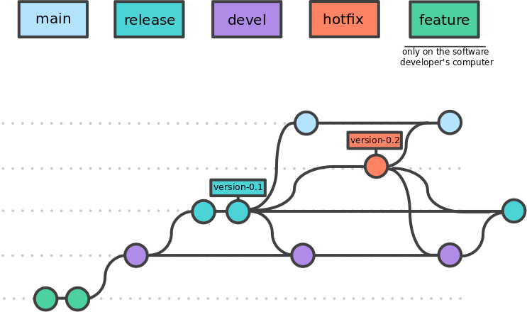
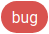

..   This file is part of biogitflow
   
     Copyright Institut Curie 2020
     
     This file is part of the biogitflow documentation.
     
     You can use, modify and/ or redistribute the software under the terms of license (see the LICENSE file for more details).
     
     The software is distributed in the hope that it will be useful, but "AS IS" WITHOUT ANY WARRANTY OF ANY KIND. Users are therefore encouraged to test the software's suitability as regards their requirements in conditions enabling the security of their systems and/or data. 
     
     The fact that you are presently reading this means that you have had knowledge of the license and that you accept its terms.

.. |step1| replace:: Step 1 - software development
.. |step1-cw| replace:: Code writing
.. |step1-ud| replace:: Deployment in the dev environment
.. |step1-testing| replace:: Testing

.. |step2| replace:: Step 2 - acceptance testing
.. |step2-acceptance| replace:: Acceptance testing by end-users
.. |step2-changelog| replace:: Update the CHANGELOG
.. |step2-optesting| replace:: Implement and launch the operational testing on Jenkins

.. |step3| replace:: Step 3 - check the installation process and new testing
.. |step3-tag| replace:: Add a tag with the version number
.. |step3-deployvalid| replace:: Deployment in the valid environment
.. |step3-testvalid| replace:: Test the version deployed in the valid environment

.. |step4| replace:: Step 4 - production deployment
.. |step4-updatelocal| replace:: Update the local repository with the version to deploy
.. |step4-deployprod| replace:: Deployment in the prod environment

.. |userd| replace:: developer (**D**)
.. |userd-ud| replace:: user (**D+UD**)
.. |userm-ud| replace:: user (**M+UD**)
.. |userm-uvp| replace:: user (**M+UVP**)

.. |repo| replace:: **remote repository**
.. |wks| replace:: **local workspace**
.. |soft| replace:: bioinformatics pipeline
.. |gitlabissue| replace:: GitLab issue

.. |biogitflowdocsource| replace:: source of the biogitflow documentation
.. _biogitflowdocsource: https://github.com/bioinfo-pf-curie/biogitflow

.. |biogitflowcitation| replace:: Kamoun C, Roméjon J, de Soyres H et al. biogitflow: development workflow protocols for bioinformatics pipelines with git and GitLab [version 1; peer review: awaiting peer review]. F1000Research 2020, 9:632 https://doi.org/10.12688/f1000research.24714.1.
.. _biogitflowcitation: https://doi.org/10.12688/f1000research.24714.1

.. |biogitflowdoc| replace:: biogitflow documentation
.. _biogitflowdoc: https://biogitflow.readthedocs.io

.. |biogitflowtemplate| replace:: biogitflow template
.. _biogitflowtemplate: https://gitlab.com/biogitflow/biogitflow-template

.. |biogitflowtemplatedir| replace:: biogitflow templates
.. _biogitflowtemplatedir: https://gitlab.com/biogitflow/biogitflow-template/-/blob/master/.gitlab

.. |git| replace:: git
.. _git: https://git-scm.com/

.. |gitflow| replace:: gitflow
.. _gitflow: https://nvie.com/posts/a-successful-git-branching-model/

.. |gitprojecturl| replace:: git@gitlab.com:biogitflow/biogitflow-demo.git
.. _gitprojecturl: git@gitlab.com:biogitflow/biogitflow-demo.git

.. |gitlaburl| replace:: GitLab
.. _gitlaburl: https://gitlab.com

.. |gitlab| replace:: GitLab
.. _gitlab: https://docs.gitlab.com/

.. |jenkins| replace:: jenkins
.. _jenkins: https://jenkins.io/ 

.. |ISTQB| replace:: International Software Testing Qualifications Board
.. _ISTQB: https://www.istqb.org/downloads/glossary.html

   
.. |dangertag| replace:: Tags with version number are not used to deploy the code but only a commit ID. Indeed, a tag can be easily removed or moved in git thus it is not a reliable information for tracking. This is why commit ID are used for deployment.
